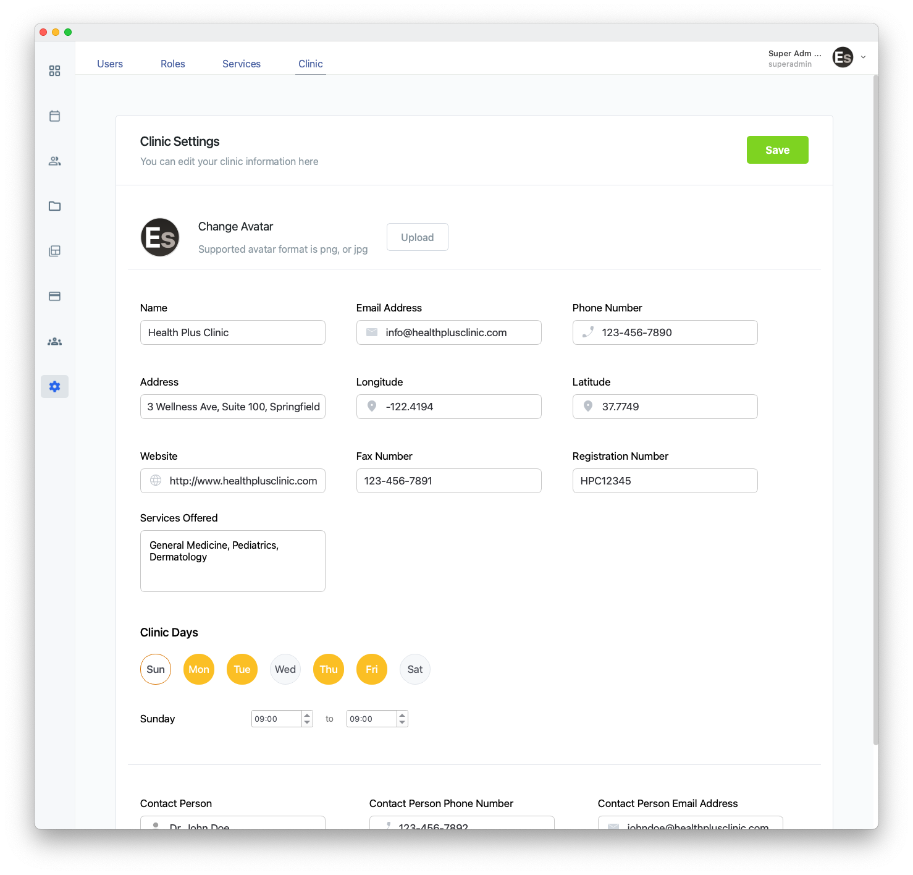
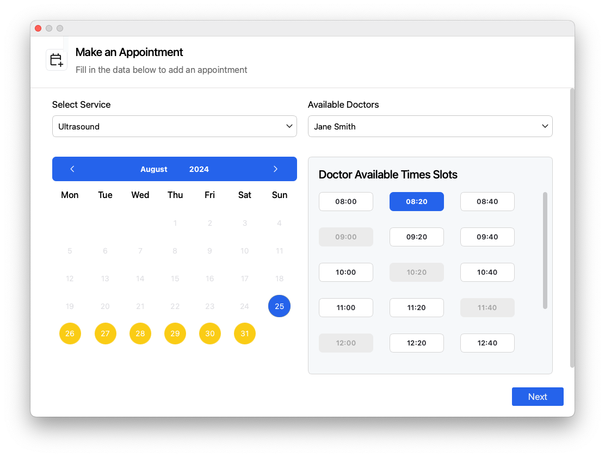
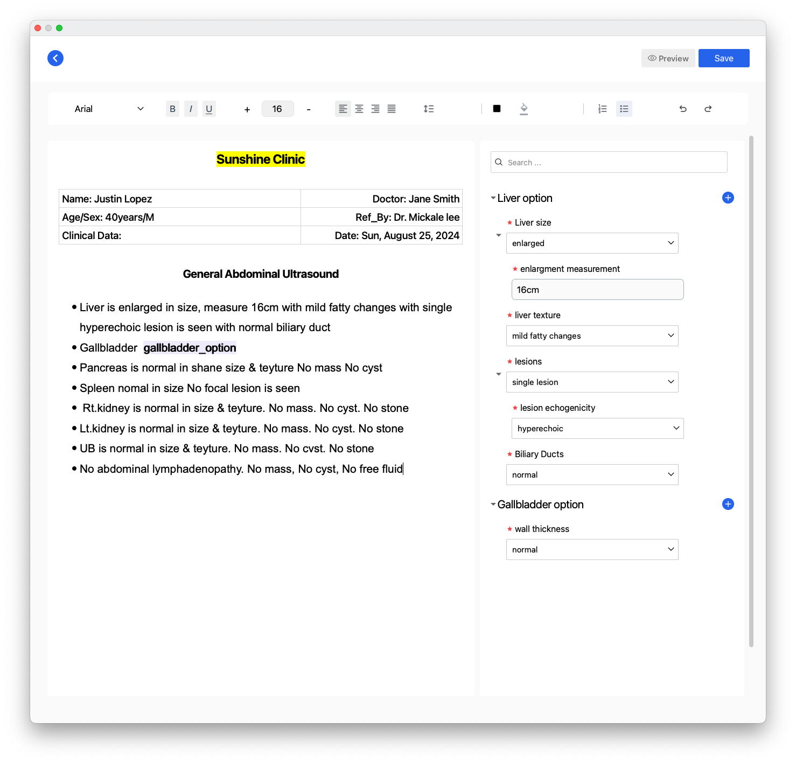

# <div align="center">Easely: Clinic Management Application</div>

<div align="center">
  
</div>

<div align="center">
  <a href="https://easely.app/"></a>
  <a href="https://github.com/rukaya-dev/easely"></a>
  <a href="LICENSE"></a>
  <a href="https://www.python.org/"></a>
  <a href="#"></a>
</div>

Easely is a **cloud-based desktop application** designed to streamline clinic management. Built with **PyQt6** for a robust graphical user interface and **Supabase** for scalable backend services, Easely simplifies patient report management, scheduling, analytics, and staff coordination. It runs seamlessly on **Linux**, **macOS**, and **Windows**, offering flexibility for healthcare professionals. Explore more at [easely.app](https://easely.app/).

---

## Navigation
- [Overview](#overview)
- [Features](#features)
- [Prerequisites](#prerequisites)
- [Installation](#installation)
  - [Using Bash Script](#using-bash-script)
  - [Manual Installation](#manual-installation)
- [Usage](#usage)
- [Environment Variables](#environment-variables)
- [Directory Structure](#directory-structure)
- [Troubleshooting](#troubleshooting)
- [Contributing](#contributing)
- [License](#license)

---

## Overview
🌟 Easely empowers clinics to boost operational efficiency and patient care. With **PyQt6** for cross-platform desktop functionality and **Supabase** for a secure Postgres-based backend, it offers an intuitive interface for managing critical workflows. Compatible with **Linux**, **macOS**, and **Windows**, Easely ensures accessibility across devices.

Here’s a glimpse of Easely’s interface:

<table>
  <tr>
    <td align="center">
      
      <br>Appointments
    </td>
    <td align="center">
      
      <br>Clinic
    </td>
  </tr>
  <tr>
    <td align="center">
      
      <br>Create appointment
    </td>
     <td align="center">
      
      <br>Report Example
    </td>
  </tr>
</table>

---

## Features
🚀 Easely provides powerful tools for clinic management:
- **Patient Report Management**: Create and organize reports with templates for quick, error-free documentation compliant with privacy standards.
- **Scheduling**: Optimize appointment scheduling to avoid conflicts and maximize efficiency.
- **Analytics & Insights**: Monitor patient data and clinic performance for actionable insights.
- **Staff Management**: Coordinate tasks, schedules, and communication for doctors, assistants, and referring physicians.
- **Multi-Device Access**: Access Easely across devices via its cloud-based architecture.
- **Customizable Editor**: Tailor report creation to your clinic’s needs.
- **Intuitive Interface**: Designed for speed, accuracy, and ease of use.

---

## Prerequisites
📋 Before installing Easely, ensure you have:
- **Python 3.9+** and **pip3** for dependency management.
- **Supabase CLI** for Supabase project management (requires `supabase login`).
- **PyQt6** for the desktop GUI (installed via `requirements.txt`).
- **Git** for cloning the repository.
- **Bash** (default on Linux/macOS; use Git Bash or WSL on Windows).
- A `requirements.txt` file with `PyQt6`, `supabase-py`, and other dependencies.
- A `configs/create_admin.py` script for superadmin user creation.

---

## Installation

### 🛠️ Using Bash Script
Automate setup with the `init.sh` (or `setup_supabase.sh`) script:

1. **Clone the Repository**:
   ```bash
   git clone https://github.com/your-username/easely.git
   cd easely
   ```

2. **Log in to Supabase CLI**:
   ```bash
   supabase login
   ```

3. **Make the Script Executable**:
   ```bash
   chmod +x init.sh
   ```

4. **Run such that the Script**:
   The script handles virtual environment creation, dependency installation, `.env` configuration, Supabase linking, schema synchronization, migrations, and optional superadmin creation:
   ```bash
   ./init.sh
   ```
   - Provide Supabase URL, Service Role Key, Superadmin Email, Superadmin Password, and Project Reference ID.
   - Confirm overwriting if a `.env` file exists.
   - If migration push fails, specify a migration version (e.g., `20240620`) for repair.

### Manual Installation
Set up Easely manually using Bash and Supabase CLI:

1. **Clone the Repository**:
   ```bash
   git clone https://github.com/your-username/easely.git
   cd easely
   ```

2. **Log in to Supabase CLI**:
   ```bash
   supabase login
   ```

3. **Set Up Python Virtual Environment**:
   ```bash
   python3 -m venv venv
   source venv/bin/activate
   ```
   On Windows:
   ```bash
   .\venv\Scripts\activate
   ```

4. **Install Dependencies**:
   Ensure `requirements.txt` includes `PyQt6` and `supabase-py`:
   ```bash
   pip3 install -r requirements.txt
   ```

5. **Configure Environment Variables**:
   Create a `.env` file:
   ```bash
   cat << EOF > .env
   SUPABASE_URL=https://your-project.supabase.co
   SUPABASE_SERVICE_CLIENT_ROLE_KEY=your-service-role-key
   SUPER_ADMIN_EMAIL=superadmin@easely.app
   SUPER_ADMIN_PASSWORD=your-password
   EOF
   ```
   Secure it:
   ```bash
   chmod 600 .env
   ```

6. **Set Up Supabase**:
   - **Link to Supabase Project**:
     Use your project reference ID (e.g., `wrxqlvsslhlyxkzftnej`):
     ```bash
     supabase link --project-ref your-project-ref
     ```
   - **Pull Schema**:
     ```bash
     supabase db pull
     ```
   - **Create a New Migration**:
     ```bash
     supabase migration new new-migration
     ```
   - **Push Migrations**:
     ```bash
     supabase db push
     ```
     If it fails, repair:
     ```bash
     supabase migration repair --status reverted 20240620
     supabase db push
     ```

7. **Create Superadmin User (Optional)**:
   ```bash
   python3 configs/create_admin.py
   ```

8. **Deactivate Virtual Environment**:
   ```bash
   deactivate
   ```

---

## Usage
▶️ To run Easely:
1. Activate the virtual environment:
   ```bash
   source venv/bin/activate
   ```
   On Windows:
   ```bash
   .\venv\Scripts\activate
   ```
2. Launch the application:
   ```bash
   python main.py
   ```
3. Log in with the superadmin credentials from the `.env` file.
4. Manage patient reports, schedules, staff, and analytics via the intuitive interface.

Easely connects to your Supabase instance for real-time data synchronization and secure access.

---

## Environment Variables
🔧 The `.env` file contains:
- `SUPABASE_URL`: Supabase project URL (e.g., `https://your-project.supabase.co`).
- `SUPABASE_SERVICE_CLIENT_ROLE_KEY`: Service Role Key for authentication.
- `SUPER_ADMIN_EMAIL`: Superadmin email (e.g., `superadmin@easely.app`).
- `SUPER_ADMIN_PASSWORD`: Superadmin password (minimum 6 characters).

---

## Directory Structure
```
easely/
├── app.log                          # Application log file
├── configs/                         # Configuration files
│   ├── app_config.py                # General app configurations
│   ├── create_admin.py              # Superadmin creation script
│   └── supa_base_configs.py         # Supabase configuration
├── database/                        # Database management
│   └── db_manager.py                # Database connection and queries
├── init.sh                          # Initialization script
├── loggers/                         # Logging utilities
│   └── logger_configs.py            # Logger configuration
├── main.py                          # Main application entry point
├── requirements.txt                 # Python dependencies
├── resources/                       # Static assets
│   ├── fonts/                      # Font families
│   ├── icons/                      # SVG icons for UI
│   └── images/                     # Images (e.g., logo.png)
├── resources.py                     # Compiled Qt resources
├── resources.qrc                    # Qt resource file
├── services/supabase/               # Supabase backend logic
│   ├── controllers/                 # Business logic
│   ├── extra/                      # Utility scripts
│   ├── middlewares/                # Middleware
│   ├── models/                     # Data models
│   └── store/                      # Data access layers
├── signals.py                       # Qt signal definitions
├── steps.text                       # Development notes
├── stylesheets/                     # UI styling
│   └── common_stylesheet.py         # Common styles
├── supabase/migrations/             # Database migrations
├── tests/                           # Unit tests
├── utils/                           # Utility functions
│   ├── editor.py                   # Text editor utilities
│   ├── utlis.py                    # General utilities
│   └── validator.py                # Input validation
└── views/                           # PyQt6 UI components
    ├── activity_center/             # Activity and logs UI
    ├── appointement/               # Appointment management UI
    ├── billing/                    # Billing UI
    ├── componenets/                # Reusable UI components
    ├── dashboard/                  # Analytics UI
    ├── editor/                     # Report editors
    ├── layouts/                    # Main window layouts
    ├── login/                      # Authentication UI
    ├── navbar/                     # Navigation bar UI
    ├── patient/                    # Patient management UI
    ├── report/                     # Report management UI
    ├── report_workshop/            # Report template UI
    ├── settings/                   # Settings UI
    ├── side_bar/                   # Sidebar navigation UI
    └── staff/                      # Staff management UI
```

### Key Notes
- **Core Files**: `main.py`, `requirements.txt`, and `init.sh` drive setup.
- **Resources**: `resources/` includes fonts, icons, and images for the GUI.
- **Supabase**: `services/supabase/` manages backend logic; `supabase/migrations/` handles schema changes.
- **UI**: `views/` organizes PyQt6 widgets for clinic features.
- **Configuration**: `configs/` contains Supabase and app settings.

---

## Troubleshooting
- **Supabase CLI Login Error**: Ensure `supabase login` completes successfully.
- **Missing `requirements.txt`**: Create with `PyQt6`, `supabase-py`, etc.
- **Migration Push Failure**: Repair with `supabase migration repair --status reverted <version>` and retry.
- **PyQt6 Import Issues**: Verify virtual environment is active and PyQt6 is installed.
- **Permission Denied**: Check directory write permissions.
- **Missing `create_admin.py`**: Skip superadmin creation or add the script.

See [Supabase Documentation](https://supabase.com/docs) or [PyQt6 Documentation](https://www.riverbankcomputing.com/software/pyqt/) for details. Open an issue for project-specific problems.

---

##  Contributing
1. Fork the repository.
2. Create a feature branch (`git checkout -b feature/your-feature`).
3. Commit changes (`git commit -m "Add your feature"`).
4. Push to the branch (`git push origin feature/your-feature`).
5. Open a pull request.

Include tests and update documentation as necessary.

---

## License
📜 Licensed under the Apache License, Version 2.0. See [LICENSE](LICENSE) for details. Retain copyright notice, attribution, and license terms in redistributed or modified versions, crediting the Easely Team as the original developer.
